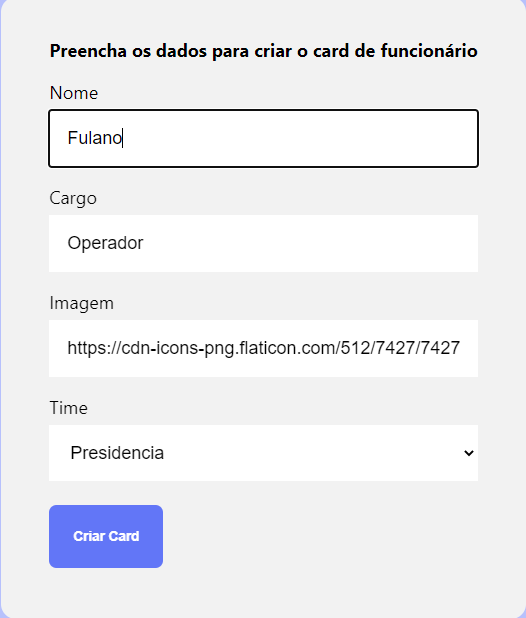
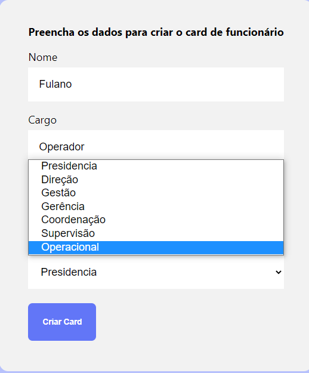
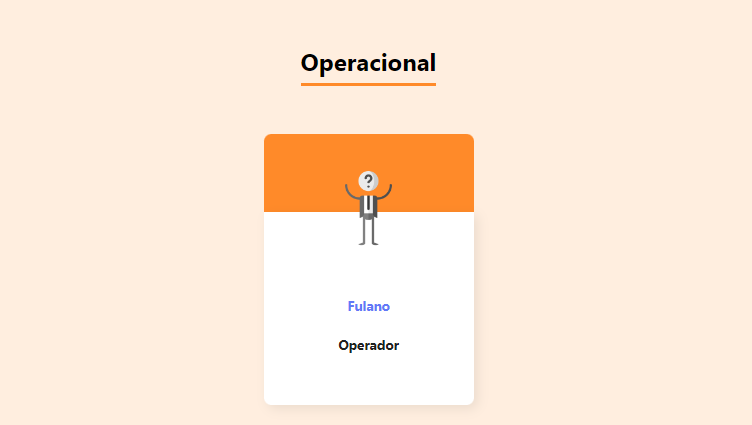

<header>

<h1>Uma representação visual e estruturada do seu negócio!</h1>
</header>

## 📖 Sobre o projeto
 **Organo** é um projeto desenvolvido em **React** que visa representar visualmente a 
 estrutura organizacional dos membros de uma empresa através de cards personalizados.
 
 ## 🖥️ Layout 
 
 ### Banner
 
 ### Formulário
 
 ### Cards - Presidencia e Direção
 
 ### Cards - Coordenação e Operacional
 
 
 ## 🖱️ Como utilizar
 

 <h4>1- Preencha os dados do formulário</h4>
 
 

 
 

 <h4>2- Selecione o "time" ao qual pertence o funcionário e clique em "Criar Card"</h4>
 
 

 
 

 <h4>3- Pronto! Seu card já foi criado, agora personalize seu organograma como quiser</h4>
 
 

 
 
 ## 🔨 Ferramentas utilizadas

 
 
 
 
 

## 📚 Objetivo 
Projeto de caráter educativo com intenção de aprender a manipular a biblioteca 'React' utilizando seus hooks e outras funcionalidades.

