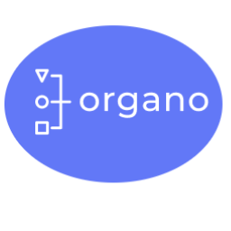

<header>

<h1>Uma representação visual e estruturada do seu negócio!</h1>
</header>

## 📖 Sobre o projeto
 **Organo** é um projeto desenvolvido em **React** que visa representar visualmente a 
 estrutura organizacional dos membros de uma empresa através de cards personalizados.
 
 ## 🖥️ Layout 
 
 ### Banner
 
 ### Formulário
 
 ### Cards - Presidencia e Direção
 
 ### Cards - Coordenação e Operacional
 
 
 ## 🖱️ Como utilizar
 **Preencha o formulário com os dados do funcionário**
 Obs: No campo "imagem" preencha com o link da sua imagem
 
 **Selecione o "time" ao qual seu funcionário pertence e clique no botão 'Criar Card'**
 
 **Pronto! Seu card de funcionário já foi criado agora você pode montar seu organograma**
 
 
 ## 🔨 Ferramentas utilizadas
 ### React 
 

